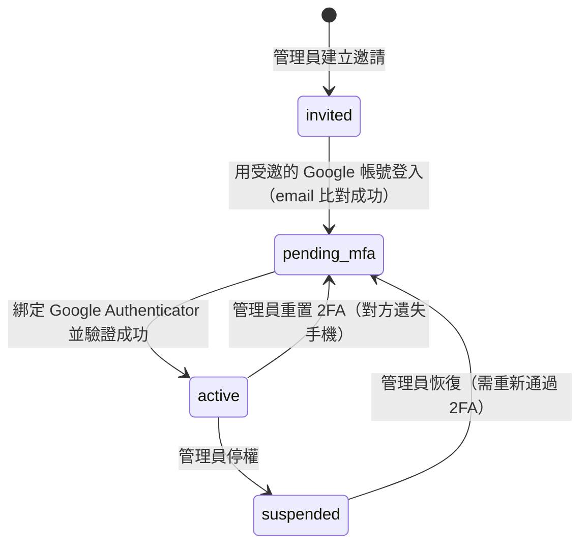
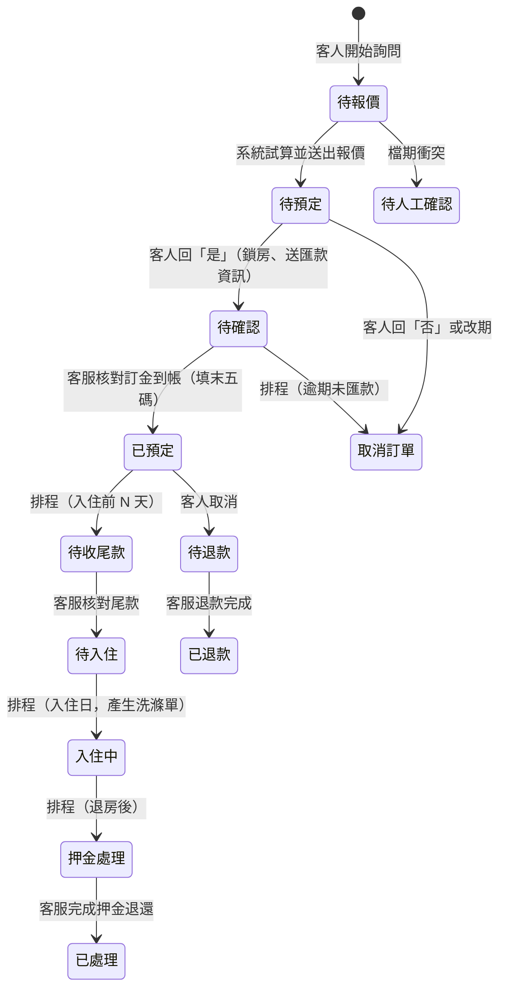

# 民宿 AI 客服後台 系統規格書

| 項目 | 內容 |
|---|---|
| 文件版本 | 1.0 |
| 對應程式版本 | `dev-online` 分支 `8b846b5`（2026-09-13） |
| 適用對象 | 民宿經營者、客服人員、系統維護者 |
| 文件來源 | 依實際程式碼盤點撰寫，非設計稿。程式為準，本文件解釋程式的行為與理由 |

---

## 目錄

1. [系統概述](#1-系統概述)
2. [系統架構](#2-系統架構)
3. [使用者角色與權限](#3-使用者角色與權限)
4. [帳號註冊與登入安全](#4-帳號註冊與登入安全)
5. [後台功能模組](#5-後台功能模組)
6. [業務流程](#6-業務流程)
   - 6.1 LINE 訊息處理總流程
   - 6.2 訂房對話流程（意圖優先）
   - 6.3 訂單生命週期
   - 6.4 報價計算
   - 6.5 確認訂房與收款
   - 6.6 候補機制
   - 6.7 真人客服轉接
   - 6.8 排程任務
   - 6.9 多 LINE 官方帳號與通知
   - 6.10 行事曆與 OTA 同步
   - 6.11 備品與布巾洗滌
   - 6.12 客製訊息發送
   - 6.13 非報價流程：一般收集與查詢訂單
7. [資料模型](#7-資料模型)
8. [後端 API（Netlify Functions）](#8-後端-apinetlify-functions)
9. [訊息變數](#9-訊息變數)
10. [診斷與稽核紀錄](#10-診斷與稽核紀錄)
11. [系統設定項目](#11-系統設定項目)
12. [測試](#12-測試)
13. [已知限制與注意事項](#13-已知限制與注意事項)

---

## 1. 系統概述

### 1.1 目的

本系統是民宿的 **LINE 官方帳號 AI 客服 + 訂房管理後台**。客人透過 LINE 與民宿對話，系統自動：

- 回答民宿相關問題（依知識庫）
- 引導客人完成訂房詢問，自動試算報價
- 處理確認、收款回報、候補
- 在需要時通知真人客服接手

民宿人員透過網頁後台管理訂單、房型、價格、對話流程、客戶資料與系統設定。

### 1.2 設計原則

| 原則 | 說明 |
|---|---|
| **價格絕不由 AI 決定** | 日期判斷、定價計算、房型分配全部由程式確定性運算。AI 只負責理解客人的自然語言、判斷意圖，以及把算好的結果包裝成訊息 |
| **先判斷意圖再處理** | 客人每一句話先分類「想做什麼」（提供資訊／問問題／確認／修改…），再依意圖分派，不假設客人一定照劇本走 |
| **訂單是唯一資料來源** | 所有訂房紀錄存在 `bookings` 表，不鏡射到其他系統 |
| **零公開註冊、強制雙因素** | 後台只有受邀的 Google 帳號能登入，每次登入都要通過 Google Authenticator |
| **每一步都留紀錄** | 客人每則訊息的處理過程、後台每次資料異動、系統每次錯誤都可在後台查到 |

---

## 2. 系統架構

### 2.1 技術組成

| 層 | 技術 |
|---|---|
| 前端 | React 18、TypeScript、Vite、React Router、MUI + Tailwind、lucide-react |
| 後端 | Netlify Functions（Node.js 18、TypeScript） |
| 資料庫 | Supabase（PostgreSQL、Row Level Security、Auth、Storage） |
| 對話平台 | LINE Messaging API（支援多個官方帳號） |
| AI | OpenAI（GPT-4 系列走 Chat Completions；GPT-5 系列走 Responses API）或 Google Gemini，後台可切換 |
| 外部整合 | Google Calendar（推送房況）、OTA iCal（Airbnb／Booking.com／Agoda／Trip 匯入與匯出） |

### 2.2 部署

- 前端與 Functions 一起部署在 Netlify；`git push` 到 `dev-online` 自動部署
- 資料庫 schema 由 `supabase_schema.sql` 維護，可重複執行（idempotent）
- 排程由 `netlify.toml` 定義：`scheduled-tasks-run` 每 15 分鐘檢查一次到期的排程、`cleanup-conversations` 每日執行

### 2.3 環境變數

| 變數 | 用途 |
|---|---|
| `VITE_SUPABASE_URL`、`VITE_SUPABASE_ANON_KEY` | 前端連 Supabase（受 RLS 限制） |
| `SUPABASE_URL`、`SUPABASE_SERVICE_ROLE_KEY` | Functions 連 Supabase（繞過 RLS，權限在程式內檢查） |
| `PUBLIC_SITE_URL` | 邀請信連結的網址（沒設就用 Netlify 的 `URL`） |

LINE 憑證、AI 金鑰、Google 服務帳號都存在資料庫（`settings`、`line_channels`），由後台設定，不在環境變數。

---

## 3. 使用者角色與權限

### 3.1 角色

| 角色 | 代碼 | 權限摘要 |
|---|---|---|
| 管理員 | `admin` | 全部功能：系統設定、價格設定、帳號管理、API 金鑰與 LINE 串接都能看能改 |
| 客服人員 | `staff` | 日常營運：訂單、行事曆、客戶、AI 客服中心、備品、訊息發送可讀可寫；價格與房型只能看；碰不到系統設定與帳號管理 |
| 唯讀 | `viewer` | 只能查看訂單、行事曆、客戶與總覽，不能新增或修改任何資料 |

### 3.2 權限字串與頁面存取矩陣

前端以「權限字串」判斷（`src/app/permissions.ts`），角色 → 權限的對照只寫在那一處；頁面與按鈕宣告自己需要哪個權限（`src/app/navigation.ts` 的 `permission`、`<Can permission>`），加新頁面不用改角色定義。

| 權限 | admin | staff | viewer |
|---|:-:|:-:|:-:|
| `dashboard.view`、`booking.view`、`calendar.view`、`customer.view` | ✓ | ✓ | ✓ |
| `booking.create/edit/payment/cancel`、`customer.edit`、`service.view/reply/handover`、`marketing.view/send`、`housekeeping.view/manage` | ✓ | ✓ | – |
| `inventory.view`、`pricing.view`（只能看） | ✓ | ✓ | – |
| `service.config`（對話流程、知識庫、客服規則）、`inventory.manage`、`pricing.manage`、`integration.*`、`automation.*`、`account.*`、`audit.view`、`system.manage`、`customer.delete_personal_data` | ✓ | – | – |

對應到選單（第 5 章）：viewer 只看得到 工作台／訂房營運／客戶與行銷（唯讀，頂端有提示列）；staff 看不到 串接管理／自動化排程／系統管理；未登記在導覽設定裡的路徑預設只有管理員可進（deny by default）。

### 3.3 權限落實的三個層次

1. **選單與按鈕**：依權限隱藏看不到的頁面與操作（只是介面引導，不是防線）
2. **路由守衛**：手動輸入網址也會被導回有權限的頁面（`canAccessRoute` 從導覽設定取權限）
3. **資料庫 RLS**（真正的防線）：`current_admin_role()` 依 `admin_profiles.role` 與 `status = 'active'` 且 session 已通過 2FA（`aal2`）判斷；唯讀角色的寫入在資料庫層就被拒絕，前端擋不擋都一樣

Functions 使用 service role 繞過 RLS，因此每支需要授權的 Function 都以 `requireRole()` 自行檢查角色、帳號狀態與 2FA 等級。

### 3.4 主帳號

`settings.primary_admin_id` 指定一個「主帳號」（通常是老闆）：不能被其他管理員停權、降級或移除，也是唯一能執行「清除客戶個資」的帳號。系統會防止移除最後一個可用的管理員。

---

## 4. 帳號註冊與登入安全

### 4.1 帳號狀態機



| 狀態 | 意義 | 能做什麼 |
|---|---|---|
| `invited` | 邀請已寄出，尚未用 Google 驗證 | 無 |
| `pending_mfa` | Google 驗證通過，尚未綁定 2FA | 只能進 2FA 綁定頁，讀不到任何資料 |
| `active` | 正常 | 依角色 |
| `suspended` | 停權 | 登入即被登出 |

### 4.2 新同事上線流程

1. 管理員在「帳號管理」輸入對方的 **Google 信箱**與角色 → 系統產生 24 小時有效的邀請（`admin_invitations`，只存 token 的 SHA-256 雜湊）並寄出邀請信；畫面同時顯示邀請連結可直接複製給對方
2. 對方點開連結 → 邀請確認頁顯示遮罩後的信箱與角色 → 點「使用 Google 登入」
3. 登入回來後，後端（`accept-invite`）比對 **Google 帳號的 email 是否等於被邀請的 email**，不一致直接拒絕並登出。這是「零公開註冊」的把關點——即使沒收到信、或連結失效，只要用對的 Google 帳號登入一樣能過
4. 強制進入 2FA 綁定頁：掃 QR Code 加入 Google Authenticator → 輸入 6 碼 → 帳號變 `active`
5. 之後每次登入：Google 登入 → 輸入 6 碼驗證碼 → 進後台

### 4.3 每次登入的安全機制

- 登入方式只有 Google（無密碼登入）
- Supabase session 的 `aal` 等級：`aal1` = 只過 Google，`aal2` = 也過了 TOTP。RLS 與 Functions 都要求 `aal2`，`aal1` 的 session 一張表都讀不到（唯一例外：讀自己的 `admin_profiles`，否則無法得知自己該去綁定還是驗證）
- 驗證碼連續錯 5 次鎖 15 分鐘（`mfa_login_attempts`）
- 2FA 頁面使用「封閉式佈局」，沒有任何後台選單

### 4.4 遺失驗證器

管理員可在「帳號管理」為他人重置 2FA。若**唯一的管理員**自己遺失，需到 Supabase SQL Editor 執行救援指令（見 `SUPABASE_AUTH_SETUP.md` 第四節）。

---

## 5. 後台功能模組

V2 資訊架構（2026-09）：側欄只到第一層（9 個入口，分 營運／商品／自動化／管理 四區），進入模組後以上方頁籤切換第二層。導覽的唯一來源是 `src/app/navigation.ts`（標題、說明、權限、路徑都從這裡讀）；舊網址全部保留自動轉址（`LEGACY_REDIRECTS`），書籤與圖文選單連結不會壞。

介面規則：狀態一律用 Badge 呈現（五種語意色調：灰＝起點／結案、藍＝等待中、綠＝已成立、琥珀＝等人動手、紅＝衝突／退款），整列不上色；列表篩選與分頁放在網址（重新整理、分享連結都回到同一個檢視）；手機（<768）表格轉卡片、側欄變抽屜、詳情頁改摺疊、主要操作固定在底部；日期 `2026/09/20`、金額 `NT$ 12,000` 由 `src/lib/format.ts` 統一。

### 5.1 工作台 `/`
一進後台先回答「今天有誰要來、有什麼要處理、系統有沒有壞」：
- KPI 兩列：今日入住、今日退房、待核款、待客服（含今日對話／轉接數）、待收尾款、押金處理、待退款、候補／衝突——每張卡點下去就是對應篩選的訂單列表
- **今日待辦**：從現有資料推導（見 5.2 待辦事項），依 緊急 → 待處理 → 例行 排序
- **未來 7 日入住**：依日期分組的入住清單
- **系統健康**（僅管理員）：LINE／AI／OTA／Google 行事曆／自動化 各顯示 正常／警告／異常／未設定，異常才醒目

### 5.2 訂房營運 `/bookings`
- **訂單** `/bookings`：MUI 表格（訂單編號、客戶、入住 → 退房、人數、房型、來源、金額、付款、狀態、操作）；快速檢視 全部／待處理／即將入住／住宿中／已完成／已取消／OTA；依狀態的 1～9 關卡 Chip（帶即時筆數）；關鍵字、入住日期、狀態、房型篩選；每 30 秒背景刷新；管理員可批次刪除；`?edit=<id>`／`?new=1` 直接開編輯／新增對話框。「全部」預設不含已取消。
- **訂單詳情** `/bookings/:id`：訂房資訊、金額與付款、備註、布巾洗滌｜狀態與流程（1～9 進度、下一步、取消）、客戶、系統紀錄（管理員看得到 `operation_logs` 時間軸）。取消／刪除都先確認並列出訂單編號與客戶；刪除要輸入訂單編號。OTA 撞期、候補、重新報價取代等關聯訂單以提示列顯示。
- **編輯對話框**（列表與詳情共用）：住宿與客人資料、房間勾選、費用（依房價重算）、款項核對與備註、布巾用量、直接指定狀態／儲存並前往下一關／取消訂單。狀態改為「已預定」時**強制填寫匯款末五碼**；「待入住」才可填入住密碼。
- **房況行事曆** `/bookings/calendar`：月檢視，色塊只用五種語意色調（同 Badge），報價階段以虛線框區隔；手機預設依入住日分組的列表、可切回月檢視；點色塊可直接進訂單。旺季／連假設定、手動整合第三方、預覽匯出行事曆依權限顯示。
- **待辦事項** `/bookings/tasks`：沒有待辦資料表，全部從現有資料推導——OTA 撞期、系統攔下的撞期、候補、訂金待核對（逾期升級為緊急）、尾款未收、待退款、押金處理、真人客服待處理、24 小時內系統錯誤（管理員）。分 全部／訂房／客服／系統。處理完對應狀態一改，待辦自然消失。
- **候補／衝突** `/bookings/conflicts`：OTA 房況衝突（可「已查核，清除旗標」）、撞期待人工確認、候補中（等被卡住的訂單有結果，排程自動重新報價）。

### 5.3 客服與 AI `/service`
- **客服工作台** `/service`：三欄——對話清單（待人工／真人服務中／AI 服務中／全部，最後一句、時間、模式 Badge）｜對話內容（客人／AI／真人氣泡、系統事件置中；每次載 50 則、可載入更早；每 15 秒刷新）｜客戶脈絡（客戶、訂單、訂房 session、AI 判斷）。AI 的判斷過程不混進對話：點客人訊息旁的 ⓘ 在右欄看意圖、抓到的欄位、決策過程、錯誤；AI 原文只有管理員看得到。
  - **接手對話**：把客人切成真人模式（AI 暫停，客人持續互動會延長、逾時自動切回）；**轉回 AI 接手**：結束真人模式並關掉轉接紀錄；**標記已處理**：只關掉「客人喊找真人」的提醒，不動 AI。
  - **回覆**（`service.reply`）：直接在工作台回客人，後端用官方帳號推播、寫進對話紀錄（真人客服）、並開啟真人模式，真人跟 AI 不會同時回同一句。
  - 桌面三欄；平板兩欄＋脈絡抽屜；手機 清單 → 對話 兩頁。
- **轉接紀錄** `/service/handovers`：客人喊真人、客服主動接手的歷史，含處理人與結束時間。
- **對話流程** `/service/flows`：管理對話流程（見 6.2）；右上角「測試對話」可輸入一句話看系統判成什麼意圖、抓到哪些欄位、還缺什麼（走正式的分類與擷取，不寫訂單、不推播）。
- **AI 知識庫** `/service/knowledge`：文字或檔案條目，可啟用／停用、檔案可下載；「測試 AI 回答」用目前啟用的知識庫實際問一次 AI。
- **客服規則** `/service/rules`：真人轉接關鍵字、通知對象、真人模式逾時。

### 5.4 客戶與行銷 `/customers`
- **客戶資料** `/customers`：一個官方帳號一份聯絡人清單；狀態（未取得暱稱／已下訂／僅諮詢／已互動）、最近入住、累積訂單、累積消費、行銷拒收、最後互動——訂單相關數字即時從 `bookings` 算，不另存。
- **客戶詳情** `/customers/:id`：消費摘要、基本資料（拒收行銷開關、重新抓取 LINE 暱稱）、訂房紀錄、最近對話、開啟對話；主帳號可清除客人全部個資（需輸入暱稱確認）。
- **訊息發送** `/marketing/send`：查詢名單、勾選對象、套用範本、預覽、批次推播；顯示 LINE 額度。範本仍在此頁維護（獨立「行銷範本」頁需要分類欄位，留待資料模型調整後再做）。

### 5.5 房務管理 `/housekeeping`
- **房務總覽**：今日退房（＝待清潔）、今日入住、待洗布巾（今日入住訂單的用量件數）、低庫存耗材，附今日退房清單與低庫存清單
- **布巾** `/housekeeping/linens`（品項與單價、房型預設組合）、**耗材** `/housekeeping/consumables`
- **洗滌** `/housekeeping/laundry`：某一天入住的訂單要交給洗滌廠的布巾清單（用「洗滌單簡稱」，口徑跟排程自動發的洗滌單一致），可複製
- **房務統計** `/housekeeping/statistics`：洗滌成本統計與核對

### 5.6 房型與空間 `/inventory`
- **房間** `/inventory/rooms`、**公共空間** `/inventory/spaces`：名稱、樓層、容納人數、押金；只有「房間」會進入計價與布巾計算

### 5.7 價格中心 `/pricing`
- **價格總覽** `/pricing`：目前設定的唯讀摘要
- **價格設定** `/pricing/settings`：每床基礎價、滿載獎勵、最少接待人數、日期加價、連住折扣、平日範圍、促銷、特殊日期價、包棟方案與加人規則。押金與訂金比例只在「系統管理 → 訂房規則」維護，這裡唯讀顯示。
- **報價模擬器** `/pricing/simulator`

### 5.8 串接管理 `/integrations`（管理員）
LINE 官方帳號 `/integrations/line`、OTA `/integrations/ota`、Google 行事曆 `/integrations/google-calendar`、通知對象 `/integrations/notifications`。Token／金鑰一律遮罩，按「顯示」才看得到。

### 5.9 自動化排程 `/automation`（管理員）
自動化規則 `/automation/rules`（見 6.8，可立即執行）、執行紀錄 `/automation/history`（各排程最近一次結果）。

### 5.10 系統管理 `/admin`（管理員）
民宿基本資料、AI 引擎（供應商、模型、金鑰、參數、系統指令、忽略關鍵字，含「測試連線」）、訂房規則（訂金比例、包棟押金、匯款期限、禮金訊息、是否開放包棟）、帳號與權限、安全性、進階設定（訊息變數）、操作紀錄、錯誤紀錄。所有設定頁共用同一個外殼：載入骨架、載入失敗可重試、底部固定儲存列、未儲存離開先確認（含站內換頁）。

---

## 6. 業務流程

### 6.1 LINE 訊息處理總流程

每則客人訊息（`line-webhook`）依序經過以下關卡，任一關卡處理掉就結束：

```mermaid
flowchart TD
    A[收到 LINE 事件] --> B{群組/多人聊天室?}
    B -- 是 --> B1[只記錄群組成員, 不回覆] --> Z[結束]
    B -- 否 --> C{文字或圖片?}
    C -- 否 --> Z
    C -- 是 --> D[事件去重 + 更新聯絡人 + 記錄對話]
    D --> E{含「AI 忽略關鍵字」?}
    E -- 是 --> Z
    E -- 否 --> F{官方帳號角色}
    F -- 廠商/內部 --> F1[回一句收到, 轉知客服] --> Z
    F -- 客戶用 --> G{含「真人客服」關鍵字?}
    G -- 是 --> G1[通知客服, 回制式訊息, 記轉接] --> Z
    G -- 否 --> H{真人模式中且未逾時?}
    H -- 是 --> H1[延後計時, 不回覆] --> Z
    H -- 否 --> I{AI 功能開啟?}
    I -- 否 --> Z
    I -- 是 --> J{有進行中的訂房 session?}
    J -- 是 --> K[訂房對話流程 6.2]
    K -- 已處理 --> Z
    K -- 是問題/閒聊 --> P
    J -- 否 --> L{訊息含 ≥2 個訂房欄位?}
    L -- 三要素齊 --> L1[直接開單試算] --> Z
    L -- 部分 --> L2[開流程預填, 問缺的] --> Z
    L -- 否 --> M{符合某流程的觸發關鍵字?}
    M -- 是 --> M1[開始該流程, 送第一步] --> Z
    M -- 否 --> N{有逾時的舊 session?}
    N -- 是 --> N1[清除, 回「已逾時請重新輸入」] --> Z
    N -- 否 --> P[一般 AI 問答: 知識庫 + 近期對話 + 訂單脈絡]
    P --> Q[若來自訂房流程, 附一行提醒] --> Z
```



要點：

- **同一位客人的訊息序列化處理**（`flow_lock_at` 資料庫鎖），避免連續兩句話互相覆蓋 session
- **回覆先送、紀錄後寫**：對話紀錄等「沒人在等」的寫入延後到回覆送出後才批次執行
- 圖片只在訂房流程中有意義（匯款憑證）；流程外的圖片轉請客服查看

### 6.2 訂房對話流程（意圖優先）

這是系統的核心。客人可以用三種方式開始：**打字描述**（「我想訂 2/2 到 2/4，12 個人」）、**按選單**（觸發關鍵字如「我要訂房」，收到表單）、或**貼回填好的表單**。之後不論在哪個階段，每一句話都先判斷意圖。

#### 6.2.1 三個階段

| 階段 | 意義 | 訂單狀態 |
|---|---|---|
| 收集中 `collecting` | 還在問日期、人數等，尚未報價 | 待報價 |
| 待確認 `awaiting_confirmation` | 報價已送出，等客人回是／否 | 待預定 |
| 待匯款 `awaiting_remittance` | 客人已回是，訂單成立，等匯款回報 | 待確認 |

#### 6.2.2 意圖分類

每句話交給分類器（`src/lib/bookingIntent.ts`），輸出意圖與抽出的欄位：

| 意圖 | 意義 | 例子 |
|---|---|---|
| `provide_info` | 提供或補充訂房資訊 | 「12 個人」「入住日期：2/2」「住一晚」 |
| `confirm` | 純粹同意報價（只在待確認階段） | 「是」「好的」「確定」 |
| `decline` | 不訂了 | 「否」「不要了」「取消」 |
| `modify` | 更改已提供的資訊，帶新值 | 「改成 3 個人」「好啊但改成 10/10」 |
| `question` | 問民宿相關問題 | 「有早餐嗎」「幾點入住」「可以加床嗎」 |
| `restart` | 重新開始 | 「我要訂房」「重新報價」 |
| `payment_report` | 回報匯款（只在待匯款階段） | 「已匯款」「末五碼 12345」 |
| `unclear` | 無法判斷 | |

分類方式：

1. **明確的短答不花 AI**：「是／否」（待確認時）、「修改／重新報價」直接判定
2. **AI 模式**：一次結構化呼叫，提示詞包含目前階段、已填欄位、**客服上一句問了哪幾欄**、最近 8 則對話。這讓「1」在只缺雙人房數時是房數、在待確認時是不明；「好啊但改成 10/10」是修改不是同意
3. **系統模式或 AI 失敗**：退回規則版分類器（同一組意圖），能處理照表單格式填的回覆、「住一晚」推退房日、標籤式修改（「人數：15」）
4. **階段防呆**：AI 在收集中回 `confirm`、非待匯款回 `payment_report` 一律降級為 `unclear`；`restart` 帶了欄位值視為 `provide_info`

#### 6.2.3 分派表（三個階段共用）

| 意圖 | 收集中 | 待確認 | 待匯款 |
|---|---|---|---|
| 提供資訊 | 合併進槽位；三要素齊 → 試算報價；缺 → 只問缺的 | 重新報價 | 重新報價 |
| 修改 | 同上 | 以新內容重新報價（舊報價作廢） | 同左（舊單記 supersedes，待新報價被接受才取消） |
| 問問題 | 交一般 AI 問答，答完附「📋 訂房還需要：X」 | 附「📋 報價確認：回「是」訂房／「否」取消／「修改」重填」 | 附「📋 匯款後請回覆帳號末五碼」 |
| 確認 | 「還沒有報價可確認」+ 問缺的 | **成立訂單**（6.5） | 提醒已成立、請匯款 |
| 拒絕 | 取消詢問、清 session | 取消報價 | 通知客服人工處理（不自動取消，可能已付款） |
| 重新開始 | 沿用同一筆訂單、重送表單 | 舊單作廢／記 supersedes，重送表單 | 同左 |
| 回報匯款 | 提醒還沒報價 | 提醒先確認 | 通知客服核對 |
| 不明 | 什麼都沒填 → 當閒聊交 AI；填了一部分 → 再問缺的；三要素齊 → 選填不強求、直接試算 | 交真人判斷 | 保守當匯款回報 |

分類之前先做兩個不花 AI 的判斷：打到**別的流程**的觸發字且沒有欄位內容（通常是圖文選單按鈕）→ 顯示那個流程的第一句、session 不動；打到**本流程**的觸發字且沒有欄位內容 → 重新開始。

#### 6.2.4 槽位而非步驟

- 報價流程的欄位是一組**槽位**：入住日、退房日、人數（三要素，必填）、各房型間數（選填）、備註等自由文字（選填）
- 任何時候客人給了哪個欄位就填哪個，不看「現在第幾步」；整張表一次貼、只答一半、先問問題再回來補，全部同一條路
- **已答過的欄位不被無標籤的猜測覆蓋**（「1」不會把人數 12 蓋掉），要明確寫「人數：15」才改
- 管理員設定的「步驟問句」仍會使用，語意是「這一組欄位都還沒有答案時，用這段話問一次」，不再是關卡
- **房數留空 = 沒意見**，由系統自動配房；只有客人有指定但住不下才擋
- 只剩一欄沒填時，客人回的單一數字直接當那一欄的答案

#### 6.2.5 Session

- 存在 `user_states.booking_session`，含流程、已收集欄位、訂單 ID、階段、報價結果
- 存活時間：收集中 6 小時、待確認 24 小時、待匯款 = 匯款期限 + 24 小時
- 逾時後客人再來：舊訂單若還停在待報價／待預定，重新開始時沿用該筆，不重複開單

#### 6.2.6 典型對話

```
客人：你好，我想安排明年3月3號大約8人
系統：還需要麻煩您補充：退房日期            ← 冷啟動：抓到入住+人數，只問退房
客人：住一晚
系統：【AI 報價結果】…房價 25,000…            ← 退房=入住+1；沒指定房型→自動配房
客人：有早餐嗎
系統：我們的早餐…（知識庫）
      📋 報價確認：回「是」訂房／「否」取消／「修改」重填
客人：人數改成 10 人
系統：【AI 報價結果】…（重新試算）
客人：好
系統：（預訂單 + 匯款資訊 + 期限）
客人：12345
系統：好的，已收到您的訊息，我們核對後會盡快為您確認訂房
      （客服收到「待核對匯款」通知）
```

### 6.3 訂單生命週期



| 狀態 | 代碼 | 意義 | 佔用房間 |
|---|---|---|:-:|
| 待報價 `inquiring` | 1 | 資訊收集中，尚未算價 | – |
| 待預定 `awaiting_deposit` | 2 | 報價已送出，等客人回覆 | –（暫時登記房型，供行事曆顯示） |
| 待確認 `awaiting_confirmation` | 3 | 客人已回是，等客服核對匯款 | ✓ |
| 已預定 `reserved` | 4 | 已收訂金 | ✓ |
| 待收尾款 `awaiting_balance` | 5 | 入住前 3 天內、尾款未收 | ✓ |
| 待入住 `awaiting_checkin` | 6 | 尾款已收 | ✓ |
| 入住中 `checked_in` | 7 | 住宿期間 | ✓ |
| 押金處理 `deposit_processing` | 8 | 已退房，押金處理中 | ✓ |
| 已處理 `completed` | 9 | 結案 | ✓ |
| 取消訂單 `cancelled` | 20 | 無款項需退 | – |
| 待退款 `awaiting_refund` | 21 | 取消，款項未退 | – |
| 已退款 `refunded` | 22 | 取消，已退款 | – |
| 待人工確認 `pending_manual_conflict` | 0 | 系統偵測到檔期衝突 | ✓ |
| 外部平台已訂 `external_synced` | 0 | OTA iCal 匯入的訂單，只佔日期 | ✓ |

重要規則：

- **報價階段不鎖房**：兩位客人可能同時拿到同一批房的報價，先回「是」的鎖走；後回的人會被告知已被訂走
- 「待確認」起才算佔用；「已預定」及之後才算「已下訂」（客戶資料頁的判斷）
- 同一位客人在同一段日期已有「待確認」以後的訂單時，系統**拒絕再開一筆**並通知客服（避免重複訂房）
- 改期／重新報價產生的新訂單記 `supersedes_booking_id`，新報價被接受時舊單自動取消並通知客服確認款項

### 6.4 報價計算

純函式 `computeUnifiedMultiNightQuote()`（`src/lib/bookingEngine.ts`），輸入日期、晚數、人數、房型、定價、設定，輸出金額與標準房型。

#### 6.4.1 每晚計價 tier

優先順序：**旺季 > 連假 > 依星期**。
- 平日範圍可設「日～四」或「日～五」
- 旺季期間的平日可設算旺季價或平日價
- **特殊指定日期價格**優先權最高，命中就直接用該金額

#### 6.4.2 個別租房

```
標準房型（依人數以貪婪法湊出的床位組合）× 每床基礎價
＋ 滿載獎勵（房間住滿時）
＋ 加開房費 / 加人不加房加價
＋ 日期加價（小假日 / 旺季 / 連假）
－ 連住折扣（每晚，依「清潔 / 不清潔」選項）
－ 促銷
```

- 該 tier 沒有定價的房型 = 不開放個別租房（資料驅動，後台補價格即開放）
- 客人指定房型組合時依指定；沒指定用系統標準房型
- 人數低於最少接待人數或超過可接待人數 → 不自動報價，請客人改或轉真人

#### 6.4.3 包棟

依人數選「基礎人數 ≤ 需求人數」中最大的方案為基礎，差額用加人規則（不多開房／多開房）計算；低於最小級距不報價。

#### 6.4.4 金額組成

```
房費 room_amount     = 引擎算出的總價
押金 security_deposit = 設定值（包棟另有押金設定）
總金額 total_amount   = 房費 + 押金
訂金 deposit          = 房費 × 訂金比例
尾款 balance_due      = 總金額 − 訂金（不存欄位，即時計算）
```

### 6.5 確認訂房與收款

客人在待確認階段回「是」（`confirmQuote`）：

1. 讀取 session 裡的報價（房型／夜次）
2. **衝突檢查**：逐間房、逐晚比對其他佔用中的訂單（含 OTA 匯入）；包棟則與任何重疊訂單都算衝突。本筆取代的舊訂單不算
3. 有衝突 → 告知「已被訂走」、取消本筆、不排候補（客人正要下訂，講清楚讓他馬上決定改日期）
4. 無衝突 → 狀態改「待確認」、寫入 `reserved_at`、`payment_deadline_at`（確認當下 + 設定的小時數）、登記房間（`booking_rooms`、`booking_room_nights`）、產生洗滌單
5. 取代的舊訂單自動取消並通知客服確認是否需退款
6. 送出付款確認訊息（流程自訂或系統預設，可用訊息變數：訂金、匯款期限、訂單編號…）

之後客人回報匯款（文字或截圖）→ 系統**不自動判讀**，回「已收到，核對後確認」並推播客服「待核對匯款」；客服到 LINE 官方帳號核對到帳後，在訂單管理填末五碼、狀態改「已預定」。

逾期未回報 → 排程「訂單自動取消」處理。

### 6.6 候補機制

試算時排不出房或檔期衝突（非確認階段）：

1. 回覆客人已排入候補
2. 記一筆「監看對象」（`waitlist_blocked_by`：擋住他的是哪筆訂單／哪幾天）
3. 排程「候補處理」（`process_waitlist`）定期檢查：被監看的訂單取消或釋出 → 自動重新試算 → 成功就主動推播新報價給客人；仍失敗 → 放棄候補、轉真人並通知客服

排程重試不做「同一客人重複訂單」檢查（那是排程在重算，不是客人再問一次）。

### 6.7 真人客服轉接

- **客人主動**：訊息含「真人客服」關鍵字（後台設定）→ 記一筆 `handover_logs`、回制式訊息、推播通知客服（通知名單或 `agent_user_ids`）。**AI 不會因此靜音**——真人隨時可在 LINE 官方帳號直接插話，AI 繼續回答，避免真人沒注意到時客人完全沒人理
- **系統判斷需要真人**：待確認階段的不明回覆（「好啊但我想改…」）、待匯款階段要求取消、AI 呼叫失敗、流程設定損毀、重複訂房 → 各自推播客服，附原文與原因
- **真人模式**（AI 完全靜音）：只有系統在「流程設定損毀、對不上目前步驟」時會把客人切進真人模式，讓真人接手而不是讓客人已讀不回；客人持續互動會延後逾時，逾時（預設 30 分鐘）自動切回 AI 並結案。客服也可在「AI 客服中心」手動把該客人切回 AI。關鍵字轉接**不會**進真人模式（見上）

### 6.8 排程任務

在「排程管理」設定，每 15 分鐘檢查到期者執行；可設每日／每週幾點，可「立即執行一次」。

| 類型 | 動作 |
|---|---|
| 訂單自動取消 | 「待確認」超過匯款期限 → 取消，推播客服 |
| 訂單狀態：已預定→待收尾款 | 入住前 N 天自動推進 |
| 訂單狀態：待入住→入住中 | 入住日推進，並產生布巾洗滌單 |
| 訂單狀態：入住中→押金處理 | 退房後推進 |
| 入住前提醒 | 入住前 2 天推播客人（可套範本） |
| 尾款提醒 | 推播尾款未收的客人 |
| 各階段通知 | 待預定、待確認、入住、押金處理、洗滌等通知（可指定範本與對象） |
| 訂單完成統計推播 | 已過退房日的訂單整理成統計，推給「廠商用」「團隊內部用」帳號，每筆只推一次 |
| 第三方平台 iCal 同步 | 匯入各 OTA 的最新訂單 → 整合後推送到 Google 行事曆（建議每 15～30 分鐘） |
| 候補處理 | 見 6.6 |

每次執行結果（摘要、成功／失敗）寫回排程紀錄與操作紀錄。

### 6.9 多 LINE 官方帳號與通知

`line_channels` 支援多個官方帳號，各有角色：

| 角色 | 行為 |
|---|---|
| 客戶用 `customer` | 完整流程：訂房、知識庫問答、轉接 |
| 廠商用 `vendor` | 不跑流程也不問答；對方回一句時記錄並轉知客服（接收訂單統計、備貨回報） |
| 團隊內部用 `internal` | 同上 |

- 每個 webhook 呼叫由簽章辨識來自哪個帳號；同一 `line_user_id` 在不同帳號視為不同的人
- **通知名單**（`notification_recipient_groups`）：從某帳號的聯絡人勾選一組人，作為轉接通知、排程推播的對象；跨帳號推播一定失敗，所以名單綁定帳號
- 群組／多人聊天室的訊息只記錄成員、不進任何流程

### 6.10 行事曆與 OTA 同步

- **推送到 Google 行事曆**：排程把所有佔用中訂單（不分來源）寫成事件，供民宿人員在手機看房況；顯示尾款未收警示
- **OTA 匯入**：`ota_channels` 設定各平台的 iCal 網址，排程匯入為 `external_synced` 訂單，只佔日期避免雙重預訂；與既有訂單重疊時標記 `ota_conflict_with` 並在訂單管理顯示超賣警示
- **OTA 匯出**：每個 OTA 頻道有專屬訂閱網址（`calendar-feed?channel=token`），貼到平台的行事曆同步設定；不帶顧客個資，並排除來源是該平台自己的訂單

### 6.11 備品與布巾洗滌

- 房型設定預設布巾組合（床包幾件、毛巾幾件…），布巾品項有洗滌單價
- 訂單成立（客人回是）及推進到入住中時，依「開的房間 × 預設組合 × 換洗次數」產生 `booking_linen_usage`；換洗次數由訂單指定（同樣住 3 晚，有人只洗一次、有人中途再洗）
- 訂單管理可重新產生／編輯用量；備品管理頁統計與核對
- 耗材另有補貨管理，對應空間

### 6.12 客製訊息發送

1. 查詢客戶名單：關鍵字（姓名／電話／訂單編號）、入住日期區間、訂單狀態、房型、快速篩選
2. 勾選對象（可跨頁）
3. 選擇或編輯範本（`custom_message_templates`），可插入訊息變數
4. 右側即時預覽第一位對象套版後的樣子（LINE 泡泡樣式）
5. 確認後批次推播；顯示本月 LINE 推播額度

### 6.13 非報價流程：一般收集與查詢訂單

「LINE 自定訊息流程」除了報價訂房，還有兩種流程類型。它們**不走 6.2 的意圖分派**，維持傳統的逐步問答（`continueBookingFlow` 裡的步驟邏輯）。

#### 6.13.1 一般收集 `collect`

用途：問幾個問題、收集資訊，走完就結束（例如「特殊需求登記」「入住須知查詢」）。

1. 觸發關鍵字命中 → 建立 session（**不建立訂單**）、送第一步問句
2. 每一步：AI 模式用 AI 擷取該步欄位，系統模式用規則（標籤定位「姓名：王小明」；整步只有一個自由文字欄位時整句就是答案）
3. 欄位沒齊 → 「還需要麻煩您補充：X」；格式不符（`value_type` 為日期／數字）→ 「X 格式錯誤，請重新輸入」
4. 全部步驟走完 → 送完成訊息（`completion_message`，預設「感謝您提供的資訊，我們已經收到了！」）→ 清 session
5. `notify_agent_on_complete` 開啟時，把收集到的欄位整理成摘要推播給客服

防呆：整句被當成自由文字答案時，若這句剛好對到**別的**流程的觸發字（圖文選單按鈕），不採用，改顯示那個流程的第一句；對到**本流程**的觸發字且沒有欄位內容 → 重新開始。

#### 6.13.2 查詢訂單 `query`

用途：客人用訂單編號查自己的訂單狀態。

1. 步驟裡要有一個欄位標記為 `quote_field = 'order_number'`
2. 走完步驟後用該編號查 `bookings`，**同時比對 `line_user_id` 與官方帳號**——只有訂單本人能查到，拿到別人的編號也查不到
3. 查到 → `found_message`（可用 [訂單狀態]、[入住日期]、[總金額] 等變數，預設列出狀態與日期金額）；查無 → `not_found_message`
4. 只讀不寫、不建立任何紀錄，回覆後清 session

#### 6.13.3 三種類型對照

| | 報價 `quote` | 一般收集 `collect` | 查詢 `query` |
|---|---|---|---|
| 處理方式 | 意圖優先、槽位填充（6.2） | 逐步問答 | 逐步問答 |
| 建立訂單 | 是（待報價起） | 否 | 否 |
| 走完之後 | 試算報價 → 待確認 → 待匯款 | 完成訊息，可通知客服 | 查詢結果 |
| 專屬設定 | 報價／付款確認訊息、資料不齊訊息、房間被訂走訊息、匯款收到訊息 | 完成訊息、是否通知客服 | 查到／查無訊息 |

---

## 7. 資料模型

### 7.1 主要資料表

| 群組 | 資料表 | 用途 |
|---|---|---|
| 設定 | `settings` | 全系統設定（單列） |
| 帳號 | `admin_profiles`、`admin_invitations`、`mfa_login_attempts` | 角色、狀態、邀請、2FA 鎖定 |
| LINE | `line_channels`、`notification_recipient_groups`、`line_groups`、`line_group_members` | 多帳號、通知名單、群組 |
| 對話 | `user_states`、`conversations`、`handover_logs`、`processed_events` | 聯絡人與 session、對話紀錄（含診斷）、轉接、事件去重 |
| AI | `knowledge_base_items` | 知識庫 |
| 流程 | `booking_flows`、`booking_flow_steps`、`message_variables`、`custom_message_templates` | 對話流程、變數、範本 |
| 訂單 | `bookings`、`booking_rooms`、`booking_room_nights`、`booking_linen_usage` | 訂單、開的房間、每晚佔用、洗滌單 |
| 房型定價 | `room_types`、`room_pricing`、`room_extra_person_pricing`、`room_capacity_pricing`、`whole_house_packages`（+ `_pricing`、`_rooms`、`_extra_person_rules`）、`special_prices`、`promotions`、`booking_date_ranges` | 房型、各 tier 定價、加人、包棟、特殊價、促銷、旺季／連假區間 |
| 備品 | `consumables`、`consumable_spaces`、`linen_items`、`room_type_linen_defaults` | 耗材、布巾 |
| 排程 | `scheduled_tasks` | 排程定義與最近執行結果 |
| 稽核 | `operation_logs` | 操作與錯誤紀錄 |
| 外部 | `ota_channels` | OTA 平台 iCal 設定 |

### 7.2 `bookings` 關鍵欄位

| 欄位 | 說明 |
|---|---|
| `order_number` | 訂單編號（建單時產生） |
| `line_user_id`、`channel_id`、`nickname`、`name`、`phone` | 客人識別 |
| `checkin_date`、`checkout_date`、`nights`、`headcount`、`whole_house` | 訂房內容 |
| `room_type_label` | 人類可讀的房型摘要（列表快速顯示） |
| `room_amount`、`security_deposit`、`total_amount`、`deposit` | 金額（見 6.4.4） |
| `status` | 狀態（見 6.3） |
| `collected_answers` | 對話流程收集到的原始欄位（JSON） |
| `guest_notes` | 客人自己填的備註 |
| `notes` | 客服內部備註（系統不自動寫入） |
| `remit_last5` | 匯款末五碼（客服核對後填） |
| `reserved_at`、`payment_deadline_at` | 客人回是的時間、匯款截止時間 |
| `linen_change_count` | 換洗次數 |
| `supersedes_booking_id` | 改期時取代的舊訂單 |
| `waitlist_blocked_by` | 候補監看對象 |
| `booking_source`、`external_channel_id`、`external_uid`、`ota_conflict_with` | OTA 來源與衝突 |
| `google_event_id`、`google_synced_at` | Google 行事曆同步 |
| `completion_notified_at` | 完成統計已推播 |

### 7.3 Row Level Security

- 所有業務表啟用 RLS；策略依角色分層（唯讀角色只有 SELECT、客服可寫營運表、系統設定與帳號類只有管理員）
- 判斷函式 `current_admin_role()`、`is_admin()`、`can_operate()`、`can_view()`、`is_mfa_verified()` 皆為 `SECURITY DEFINER`，避免 RLS 檢查 RLS 的遞迴
- `mfa_login_attempts`、`admin_invitations` 無一般使用者策略，只有 service role 能碰

---

## 8. 後端 API（Netlify Functions）

路徑 `/.netlify/functions/<名稱>`。需授權者以 `Authorization: Bearer <Supabase access token>` 傳入，並要求 `aal2`。

| Function | 方法 | 授權 | 用途 |
|---|---|---|---|
| `line-webhook` | POST | LINE 簽章 | 接收 LINE 事件，全部對話邏輯（含意圖分類、報價、確認） |
| `scheduled-tasks-run` | 排程 | – | 每 15 分鐘執行到期的排程 |
| `run-task-now` | POST | admin | 立即執行一筆排程 |
| `cleanup-conversations` | 排程 | – | 依保留天數清除舊對話 |
| `custom-messages` | POST | staff+ | 客製訊息：額度、名單、聯絡人、範本、發送；`action=reply` 為客服工作台的單人回覆（推播＋寫入對話紀錄＋開啟真人模式） |
| `calendar-feed` | GET | 網址 token | OTA 訂閱用 iCal |
| `line-profile` | GET | staff+ | 取 LINE 使用者頭像／暱稱 |
| `ai-test` | POST | admin | 用畫面上的模型與金鑰實際呼叫一次 AI，回報結果 |
| `flow-test` | POST | admin | 對話流程測試模擬器：對一句話跑正式的意圖分類與欄位擷取，回報意圖／欄位／缺漏／決策過程；不寫任何資料、不推播 |
| `knowledge-test` | POST | admin | 用目前啟用的知識庫與 AI 設定回答一句測試問題（同 line-webhook 的問答路徑） |
| `invite-admin` | POST | admin | 建立邀請、寄信、回傳邀請連結 |
| `invite-verify` | GET | – | 驗證邀請碼，回遮罩信箱與角色 |
| `accept-invite` | POST | 登入者 | Google 登入後比對邀請名單，推進到待綁定 2FA |
| `mfa` | POST | 登入者／admin | 綁定完成、記失敗、查鎖定、管理員重置他人 2FA |
| `list-admins` | GET | admin | 帳號清單（含 auth 的登入時間） |
| `delete-admin` | POST | admin | 移除帳號 |
| `delete-customer-data` | POST | 主帳號 | 清除單一客人全部個資 |

所有 Function 的 4XX／5XX 與未攔截例外統一寫入 `operation_logs`。

---

## 9. 訊息變數

罐頭訊息（流程步驟、報價確認、付款確認…）、排程通知範本、客製訊息範本都可用 `[變數名稱]`，由「訊息變數資料維護」定義取值來源：

| 來源 | 變數 |
|---|---|
| 訂單 | 訂單編號、姓名／客戶姓名、入住日期、退房日期、人數／入住人數、大人小孩、是否包棟、房型、訂單狀態、總金額／總報價、訂金、押金、尾款、電話、顧客備註 |
| 客戶 | LINE 暱稱、LINE User ID |
| 民宿設定 | 民宿名稱、客服 LINE、禮金內容 |
| 系統 | 匯款日時間、今天／明天等日期變數 |

---

## 10. 診斷與稽核紀錄

### 10.1 對話處理過程（`conversations.meta`）

每則客人訊息記錄 bot 的完整決策過程，在「AI 客服中心 → 對話紀錄」每則訊息底下展開「處理過程」：

- **決策過程**：走了哪條路（被忽略、轉真人、進哪個流程、意圖判定與理由、還缺什麼、退回規則…）
- **錯誤**：AI 呼叫失敗等，紅色標示
- **流程**：流程名稱、模式、階段、欄位、已收集
- **這句抓到的欄位**、**意圖**（含來源 AI／規則、理由）
- **AI 原文**：意圖分類與問答的原始回覆、耗時

診斷寫在客人訊息那一列，所以「bot 沒回」（被忽略、真人模式中）也查得到原因。

### 10.2 操作紀錄（`operation_logs`）

後台每次資料異動：誰、何時、哪個功能、目標、改前／改後；系統異動（排程、流程自動取消）記為 `system`；Function 錯誤含狀態碼與訊息。

### 10.3 客服即時通知

AI 呼叫失敗（問答、擷取、意圖分類）、需人工判斷的回覆、待核對匯款、重複訂房、改期取代舊單、訂房流程中的圖片——都推播給客服，附原文與原因，不等客人截圖來問。

三種情況的落點整理：

| 情況 | 客人看到 | 客服工作台（該則訊息的 ⓘ） | 客服推播 | 錯誤紀錄／工作台待辦 |
|---|---|---|---|---|
| **AI 呼叫失敗**（金鑰、額度、逾時、回了讀不懂的東西） | 「系統忙線中，稍後再試或找真人客服」 | 紅色錯誤＋原因 | ⚠️ AI 呼叫失敗 |  level=error（feature ）→ 錯誤紀錄頁、工作台「系統錯誤」待辦 |
| **AI 查不到**（知識庫沒寫，AI 回「幫您確認，稍後由專人回覆」） | AI 的那句話（標記已拿掉） | 「AI 無法回答」區塊，含客人問題與 AI 回覆 | 🤖 AI 答不出來，請人工回覆 | 開一筆 open 的轉接紀錄（觸發字「AI 無法回答」）→ 工作台「待人工」、待客服 KPI、真人客服待辦 |
| **訂房流程處理中丟例外** | 「系統忙線中，稍後再試或找真人客服」 | 紅色錯誤＋原因 | ⚠️ 訂房流程處理失敗 | 只在該則訊息的處理過程 |

AI「查不到」的判斷方式：知識庫邊界指令要求模型在民宿資訊裡沒有答案時，回覆最後加上  標記；webhook 送出前拿掉標記，另外以制式句的片語（「稍後由專人回覆」等）當模型漏標記時的備援。

---

## 11. 系統設定項目

| 分類 | 設定 |
|---|---|
| AI 引擎 | 開關、供應商（GPT／Gemini）、模型名稱、API 金鑰、Temperature（GPT-5 不適用）、Max Tokens（GPT-5 含推理 token）、推理力道、詳細程度、Gemini 思考程度、系統指令、AI 忽略關鍵字 |
| LINE | 多官方帳號（名稱、角色、Token、Secret、啟用）、通知名單、OTA 頻道 |
| 轉接 | 真人客服關鍵字、真人模式逾時分鐘、客服 LINE ID 清單、轉接通知名單 |
| 對話 | 對話紀錄保留天數 |
| 民宿 | 民宿名稱、客服 LINE、禮金內容 |
| 訂房 | 是否開放包棟、訂金比例、押金（一般／包棟）、匯款期限小時、目前促銷 |
| 計價 | 每床基礎價、滿載獎勵、最少接待人數、小假日／旺季／連假加價、連住折扣（清潔／不清潔）與預設、旺季平日計價、平日範圍、特殊價是否與折扣疊加 |
| 行事曆 | Google 行事曆 ID、服務帳號 JSON、最近同步狀態 |
| 帳號 | 主帳號 |

---

## 12. 測試

`npm run test:flow` 以 esbuild 把真實的 `line-webhook.ts` 打包，外部依賴（Supabase、LINE、OpenAI）換成記憶體假件，測的是真實的編排程式碼：

| 測試檔 | 內容 |
|---|---|
| `tests/booking-flow/scenarios.test.ts` | 42 個對話情境：三階段 × 各意圖、冷啟動、AI 失敗退回、階段防呆、圖片、截圖裡的真實案例 |
| `tests/booking-flow/intent.test.ts` | 46 個分類器案例：規則分類、AI 回覆解析、晚數推算、提示詞內容 |
| `tests/booking-flow/responses-api.test.ts` | OpenAI Responses API 回應解析 |

另有 `npm run typecheck`（前端 + Functions）、`npm run lint`、`npm run build`。

---

## 13. 已知限制與注意事項

1. **AI 模式的成本**：訂房流程中每則訊息多一次意圖分類呼叫（純「是／否／重來」除外）。分類是小任務，建議用 `gpt-4.1-mini` 等輕量模型
2. **模型名稱是自由輸入**：程式依名字選 API 路徑（含 `gpt-5` 走 Responses API），是否存在由供應商決定；請用「測試連線」確認
3. **匯款不自動判讀**：末五碼與截圖一律人工核對，系統只負責通知與記錄
4. **待匯款階段的問句**：規則版無法區分「匯好了嗎可以幫我看一下」與真正的問題，AI 失敗時保守當匯款回報
5. **報價階段不鎖房**：兩位客人可能拿到同一批房的報價，先確認者得
6. **Session 逾時**：收集中 6 小時、待確認 24 小時；逾時後重新開始會沿用未完成的舊訂單
7. **知識庫沒寫的事 AI 不會答**：會回「這部分我幫您確認一下」，要讓它會答就到知識庫新增條目
8. **對話紀錄依保留天數清除**（預設 3 天），較久之前的對話與診斷查不到
9. **`conversations.meta` 欄位**：升級到含診斷紀錄的版本後必須執行 schema，否則對話紀錄寫入失敗
10. **Google 登入設定**：Supabase 的 Site URL 與 Redirect URLs、Google Cloud 的 Redirect URI 必須正確，否則邀請信連結指向 localhost（見 `SUPABASE_AUTH_SETUP.md`）

---

## 附錄：相關文件

| 文件 | 內容 |
|---|---|
| `docs/資料字典.md` | 39 張表、383 個欄位的完整說明 |
| `docs/工程師手冊.md` | 程式碼地圖、慣例、本機開發、部署與 schema 升級、常見改動食譜、除錯與故障處理 |
| `SUPABASE_AUTH_SETUP.md` | Google 登入、URL 設定、邀請信中文樣板、2FA 救援指令 |
| `supabase_schema.sql` | 完整資料庫 schema（可重複執行） |
| `src/lib/bookingIntent.ts` | 意圖分類器（提示詞、解析、規則版） |
| `src/lib/bookingEngine.ts` | 報價引擎 |
| `src/lib/bookingStatus.ts` | 訂單狀態定義 |
| `src/lib/permissions.ts` | 角色與頁面權限 |
| `netlify/functions/line-webhook.ts` | 對話處理主程式 |
